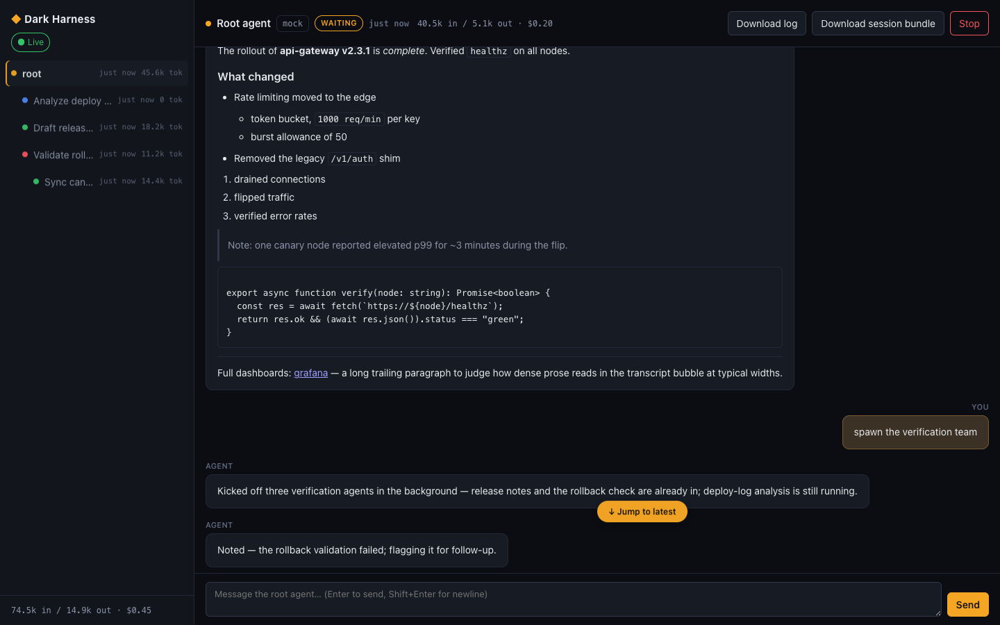

# ◆ Dark Harness

[](https://www.npmjs.com/package/dark-harness)
[](LICENSE)

*(A CI status badge belongs here too, once the repo's public URL is confirmed — see
[Status / deferred this round](#status--deferred-this-round).)*

**`dh`** is a single-binary agent harness for autonomous "dark factory" software work: point
it at a repo and an instructions file, and it runs an LLM agent — with sub-agents, a real
tool set, skills, and MCP support — until the job is done. It also runs interactively, with
both a console TUI and a web UI, so you can develop and observe locally before you let it
loose unattended.

No daemons to install, no runtime to configure — `dh` is one compiled binary that is the
server, the console client, and the web client, composed by flags.

<picture>
  <source media="(prefers-color-scheme: dark)" srcset="docs/media/hero-web-dark.png">
  <source media="(prefers-color-scheme: light)" srcset="docs/media/hero-web-light.png">
  
</picture>

*A real session, captured through the actual web UI against a scripted mock provider — see
[`e2e/spikes/web/hero-screenshot.ts`](e2e/spikes/web/hero-screenshot.ts) to reproduce it after
any visual change.*

## Security posture, up front

**`dh` speaks plaintext HTTP with no authentication by default**, and its permission model
is deliberately "everything is allowed, always" — there are no approval prompts. This is a
tradeoff for the dark-factory use case: an agent that can't ask a human before every shell
command needs to actually be able to run them.

That means **the network boundary is your only real security control.** The intended
posture is air-gapping: run `dh` in a container, on a private network, behind an SSH tunnel,
or behind a reverse proxy you control — not exposed on the open internet. Air-gapped here
means `dh` itself makes no outbound network calls except to whichever LLM provider you
configure (and whatever `git`/network access your own instructions or Bash-tool commands
make) — if you point it at a fully local provider (e.g. LM Studio or another
Anthropic-compatible local endpoint via `baseURL`), it needs no external network access at
all to run.

Concretely: the Bash tool inherits the harness process's full environment (including any
provider API key or `DH_TOKEN` referenced via `$(VAR)` in `dh.json`), with no approval prompt
before it runs. If an agent reads attacker-controlled content (a poisoned README, a malicious
issue comment, a compromised dependency) that directs it to read `process.env` and exfiltrate
those values over the network, a non-air-gapped deployment lets that succeed. Air-gapping is
the mitigation; this is the specific risk it mitigates.

For cases where air-gapping alone isn't practical, `dh` ships two independent, opt-in
protections (see [Configuration](#configuration--dhjson) below): a bearer token and TLS.
Neither turns this into a general-purpose auth system — no user accounts, no per-agent
scopes. Air-gapping remains the strongest posture even with both enabled. Full rationale:
[`docs/adr/0004-security-posture.md`](docs/adr/0004-security-posture.md).

## Quick start

### Download a prebuilt binary

Grab the binary for your platform from the [latest release](https://github.com/stefanrusek/dark-harness/releases/latest):

| OS | Arch | Asset |
| --- | --- | --- |
| Linux | x64 | `dh-linux-x64` |
| Linux | arm64 | `dh-linux-arm64` |
| macOS | x64 | `dh-darwin-x64` |
| macOS | arm64 (Apple Silicon) | `dh-darwin-arm64` |
| Windows | x64 | `dh-windows-x64.exe` |

Each release also ships `SHA256SUMS.txt`. Verify your download before running it:

```bash
sha256sum -c SHA256SUMS.txt --ignore-missing   # linux
shasum -a 256 -c SHA256SUMS.txt --ignore-missing   # macOS
```

Then make it executable (linux/macOS) and run it directly — no install step, no runtime to
set up:

```bash
chmod +x dh-linux-x64   # or your platform's asset
./dh-linux-x64
```

> **npm install (`bunx dark-harness`)**: not yet available — the published package currently
> only covers the original single-platform build. Multi-platform `optionalDependencies`
> packages exist and are wired into the release pipeline (see `tracking/DH-0004-*.md`) but
> haven't been published yet. Use a downloaded binary or build from source until that lands.

### Build from source

```bash
git clone https://github.com/stefanrusek/dark-harness.git
cd dark-harness
bun install
bun run build        # produces ./dist/dh
./dist/dh
```

Requires Bun >= 1.3. There's nothing else to install — `dh` compiles to a single binary
(`bun build --compile`) for linux/macos (x64+arm64) and windows-x64.

Scaffold a starter config and sanity-check it before your first real run:

```bash
dh init            # writes a starter dh.json in the working directory
# edit dh.json to set your API key / model
dh doctor          # makes one cheap no-op call per configured model and reports pass/fail
dh                 # local server + console TUI, using dh.json
```

With no flags, `dh` starts a server and a console TUI in one process, using `dh.json` in the
current directory (see below). Point it at a task and let it run unattended:

```bash
dh --instructions ./TASK.md --job
```

`--job` makes the process exit when the root agent finishes: `0` on self-reported success,
`1` on self-reported task failure, `2+` on a harness-level error (bad config, provider
failure, crash) — safe to branch on from CI or a scheduler without parsing logs.

## Run modes

One binary, two logical processes — **server** (runs the agents, owns state and logs) and
**client** (console TUI or web UI) — composed by flags:

| Invocation | Behavior | When to use it |
| --- | --- | --- |
| `dh` | Local: server + console TUI in one process. | Everyday interactive use on your own machine. |
| `dh --web` | Local web: server + locally-served web UI; prints the URL. | Same as above, browser UI instead of a terminal. |
| `dh --server` | Headless server only. Default port `4000`; `--port <n>` overrides. | Long-running/unattended box you'll connect to remotely, or a container for a dark-factory job. |
| `dh --connect <host>` | Console client, connecting to a remote server. | Watching/steering a session already running elsewhere. |
| `dh --connect <host> --web` | Web client, served locally, connected to a remote server. | Browser access to a remote headless server. |

The web UI is **always served client-side**, never by `--server` — a headless server exposes
only the agent API/event protocol. To get web access to a remote headless server, run
`dh --connect <host> --web` on your own machine.

Client and server talk over **HTTP + SSE on a single port** — not WebSocket — so the
connection survives ordinary HTTP proxies and reconnects cleanly via `Last-Event-ID`.

## Command-line reference

Subcommands:

| Command | Behavior |
| --- | --- |
| `dh init` | Scaffold a starter `dh.json` in the working directory (or `--config <path>`). Refuses to overwrite an existing file. |
| `dh doctor` | Alias for `--check` (below). |
| `dh logs <sessionDir>` | Print the agent tree (status/cost/duration) for a `.dh-logs/<sessionId>` directory, e.g. `dh logs .dh-logs/3f2c...`. |
| `dh logs` | List sessions under `./.dh-logs` (id, start time, agent count). |

Flags:

| Flag | Meaning |
| --- | --- |
| `--web` | Serve the web UI instead of (or alongside `--connect`) the console TUI. |
| `--server` | Run headless (no client attached). |
| `--quiet` | Suppress `--server`'s per-agent-lifecycle activity feed and SSE connect/disconnect lines. The one-time startup block still prints regardless. |
| `--connect <host>` | Connect to a remote `dh --server` instead of starting a local one. |
| `--port <n>` | Listen port for `--server`, or target port for `--connect`. Default `4000`. |
| `--instructions <file>` | Path to an instructions file. The root agent starts on it immediately, autonomously. |
| `--job` | Exit when the root agent finishes; see the exit-code table above. Without it, the process stays alive for inspection. |
| `--json` | With `--job`: stream NDJSON progress events to stdout as the run happens, closed by a final `job_result` line. Requires `--job`. |
| `--config <path>` | Path to `dh.json`. Default: `dh.json` in the working directory. |
| `--env <file>` | Load a dotenv-style file into the environment before `dh.json` is loaded/interpolated (see below). |
| `--check` | For each configured model, make one cheap no-op provider call and report pass/fail, then exit. Never enters the agent loop. Same as `dh doctor`. |
| `--dry-run` | Validate config parsing, instructions-file readability, and provider client construction, then exit `0`. Never calls a model. |
| `--resume <sessionId>` | Reconstruct the root agent's conversation from a prior `.dh-logs/<sessionId>` directory and continue it as a new session. Not supported together with `--connect`. |
| `--help`, `-h` | Show usage and exit. |
| `--version` | Show build identity (version, git sha, dirty flag) and exit. |

A few examples:

```bash
dh --config ./configs/prod.dh.json --check     # verify a specific config's providers
dh --env secrets.env                            # load API keys from a gitignored env file
dh --instructions ./TASK.md --dry-run           # sanity-check before spending any tokens
dh --resume 3f2c9e21-...                        # pick a crashed/interrupted session back up
dh logs .dh-logs/3f2c9e21-...                   # inspect a session's agent tree after the fact
```

`--resume` walks any `resumedFrom` chain in the target session's logs, reconstructs the root
agent's history, and appends a notice to the resumed conversation naming any sub-agent that
didn't survive the restart. It's not supported with `--connect` (the logs it reconstructs
from live on the *server's* filesystem, not the connecting client's), and it isn't yet
supported together with `--instructions` delivered to a remote server.

## Configuration — `dh.json`

`dh init` scaffolds a starter `dh.json` covering every model tier across every provider
type — trim it to what you use, then run `dh doctor` to check credentials. Full field-by-field
reference, provider-by-provider setup, and air-gapped deployment specifics live in
**[docs/CONFIGURATION.md](docs/CONFIGURATION.md)**; this section is the summary.

```json
{
  "options": { "defaultModel": "haiku-bedrock", "runInBackgroundDefault": true, "maxTurns": 100 },
  "models": [
    { "name": "sonnet-anthropic", "provider": "anthropic", "model": "claude-sonnet-5" },
    { "name": "sonnet-bedrock", "provider": "bedrock", "model": "us.anthropic.claude-sonnet-5" },
    { "name": "haiku-mantle", "provider": "mantle-anthropic", "model": "anthropic.claude-haiku-4-5" },
    { "name": "gemma4", "provider": "mantle-openai", "model": "google.gemma-4-31b" }
  ],
  "provider": [
    { "name": "anthropic", "type": "anthropic", "apiKey": "$(ANTHROPIC_API_KEY)" },
    { "name": "bedrock", "type": "bedrock", "region": "$(AWS_REGION)" },
    { "name": "mantle-anthropic", "type": "anthropic", "baseURL": "https://bedrock-mantle.$(AWS_REGION).api.aws/anthropic", "apiKey": "$(BEDROCK_MANTLE_API_KEY)" },
    { "name": "mantle-openai", "type": "openai-compatible", "baseURL": "https://bedrock-mantle.$(AWS_REGION).api.aws/openai/v1", "apiKey": "$(BEDROCK_MANTLE_API_KEY)" }
  ],
  "skillPaths": ["./skills"],
  "mcpServers": {},
  "systemPrompt": null,
  "security": { "token": null, "tls": null }
}
```

(Trimmed for readability — the real scaffold also lists every Claude tier on both `anthropic`
and `bedrock`, plus a `"local"` Anthropic-compatible provider and a few Bedrock open-weight
models. See [docs/CONFIGURATION.md](docs/CONFIGURATION.md#the-scaffolded-config) for the
untrimmed version.)

### Provider types

`provider[].type` is one of three, all first-class — pick whichever matches the endpoint
you're calling. Every provider also accepts an optional `retry` block (`maxAttempts`,
`baseDelayMs`, `maxDelayMs`).

| Type | Speaks | Typical use |
| --- | --- | --- |
| `"anthropic"` | Anthropic Messages API | The real Anthropic API (`apiKey`), or any Anthropic-compatible endpoint via `baseURL` (local inference servers, Bedrock Mantle's `.../anthropic` route). |
| `"bedrock"` | AWS Bedrock (bedrock-runtime) | AWS-hosted Claude/Llama/Mistral/OSS models via the standard AWS credential chain (`region`, no `apiKey` field). |
| `"openai-compatible"` | OpenAI Chat Completions API | Any endpoint speaking that shape — local OpenAI-compatible servers, Bedrock Mantle's `.../openai/v1` route. `baseURL` + optional bearer `apiKey`. |

Amazon Bedrock Mantle (a distinct endpoint from bedrock-runtime) is configured through the
`anthropic` and `openai-compatible` types above, not a bespoke provider type — see
[docs/CONFIGURATION.md](docs/CONFIGURATION.md#amazon-bedrock-mantle--configured-through-the-two-types-above-not-a-bespoke-provider-type)
for the two-route setup, the `/openai` path gotcha, and which models are live-verified.

### Models, options, and other top-level fields

- **`models[]`** — `name`, `provider` (a `provider[].name`), `model` (provider-side id) are
  required. Optional: `inputPricePerMToken`/`outputPricePerMToken` (cost display),
  `thinking` (extended-thinking opt-in), `cache`/`cacheReadPricePerMToken`/
  `cacheWritePricePerMToken` (prompt caching), `contextWindow` (required when `compaction` is
  enabled). Full behavior of each: [docs/CONFIGURATION.md](docs/CONFIGURATION.md#models).
- **`options`** — `defaultModel` (required), `runInBackgroundDefault`, `maxTurns`, and
  session-wide budget caps `maxCostUsd`, `maxTotalTokens`, `maxWallClockMs`,
  `maxConcurrentAgents`, `maxAgentDepth`. Details:
  [docs/CONFIGURATION.md](docs/CONFIGURATION.md#top-level-options).
- **`skillPaths`**, **`mcpServers`**, **`systemPrompt`**, **`security`**, **`limits`**,
  **`logRetention`**, **`web`**, **`compaction`** — see
  [docs/CONFIGURATION.md](docs/CONFIGURATION.md) for each.
- **`$(VAR)`** in any string value resolves against the environment at load time (escape as
  `$$(...)` for a literal). Use **`--env <file>`** to load a dotenv-style file before `dh.json`
  is parsed, so secrets never land in the committed config — see
  [docs/CONFIGURATION.md](docs/CONFIGURATION.md#keeping-secrets-out-of-dhjson---env-file).

Full schema rationale: [`docs/adr/0007-dhjson-schema.md`](docs/adr/0007-dhjson-schema.md).

### Security: bearer token + TLS

```json
{ "security": { "token": "$(DH_TOKEN)", "tls": { "cert": "/path/to/cert.pem", "key": "/path/to/key.pem" } } }
```

Both opt-in and independent. `security.token` requires `Authorization: Bearer <token>` on
every request (constant-time compared, never logged). `security.tls` serves HTTPS on the same
port. Neither adds user accounts or per-agent scopes — air-gapping (below) remains the
stronger control either way. Full detail:
[docs/CONFIGURATION.md](docs/CONFIGURATION.md#security-bearer-token--tls). Rationale:
[`docs/adr/0004-security-posture.md`](docs/adr/0004-security-posture.md).

### Running air-gapped

`dh` makes no outbound calls of its own beyond your configured model provider(s) — no
telemetry, no phone-home. Point `provider` at a local endpoint (`anthropic`- or
`openai-compatible`-typed, via `baseURL`) and a container running `dh` needs no network egress
at all. The recommended deployment boundary is a container on a private network, never a
headless `--server` exposed to the open internet. Two tools, `WebFetch`/`WebSearch`, are
absent unless you opt in via a `web` config block — enabling either deliberately breaks the
air-gapped posture. Full detail, including the `web.fetch`/`web.search` config shape and the
container `Dockerfile`: [docs/CONFIGURATION.md](docs/CONFIGURATION.md#running-air-gapped) and
[Container deployment](docs/deployment.md).

### Git credentials and workspace convention

`dh` has no `workspaceDir`-style config field and does no repo checkout of its own — it runs
every `Bash` command at its own working directory, and `git` inside those calls authenticates
however the host/container already has `git` set up (mounted SSH key, `GIT_ASKPASS`,
`.netrc`, or a PAT + credential helper). None of this is `dh`-specific. Full detail:
[docs/CONFIGURATION.md](docs/CONFIGURATION.md#git-credentials-and-workspace-convention).

## Tools, skills, and sub-agents

The root agent and every sub-agent get one fixed tool set, with semantics mirroring Claude
Code's tools of the same name: `Bash`, `Read`, `Edit`, `Write`, `Agent`, `ToolSearch`,
`Skill`, `TaskOutput`, `SendMessage`, `Monitor`, `TaskStop`, `McpAuth`, `Grep`, `Glob` — plus
`WebFetch`/`WebSearch` when you've opted into them via `web.fetch`/`web.search` (see
[Optional web access](#optional-web-access-webfetch--websearch) above); otherwise they don't
exist at all, not just disabled.
Sub-agents are purely ad-hoc — `Agent` takes a model name and a prompt, no predefined agent
definitions, arbitrary nesting depth, and (by default) run concurrently with their parent.

`Grep`/`Glob` are structured, cross-platform alternatives to shelling out to `grep`/`find`
via `Bash` — no shell-quoting footguns, consistent behavior across OS. `Bash`'s own
`grep`/`find` (the cli-tools skill's "generic POSIX tools") remain available too; these
aren't a replacement, just a purpose-built option for the common case.

Every session is logged automatically: one JSONL file per agent, resumable and diffable,
with enough in each file's header line to reconstruct the full agent tree without parsing
event bodies. Agents never call a logging tool — their output *is* the log. See
[JSONL log format reference](docs/jsonl-log-format.md) and `dh logs <sessionDir>` above.

Agent output is always Markdown: the built-in system prompt instructs every model to write
plain-text output as Markdown, and both the console TUI and the web UI render it as such
(headings, bold/italic, inline code, fenced code blocks, lists, blockquotes, links) rather
than showing raw Markdown syntax or passing through raw escape sequences.

## Known gaps

`dh` is under active development; one thing worth knowing about before you rely on it:

- **Model output is not streamed token-by-token.** A long assistant turn appears all at once
  in the TUI/web UI when the turn completes, rather than incrementally — see
  `tracking/DH-0044-no-streaming-partial-output.md`.

This is a UX/latency gap, not missing functionality in the sense of "the tool call doesn't
happen."

## Further documentation

- [Configuration reference](docs/CONFIGURATION.md) — full `dh.json` field walkthrough, every
  provider type, air-gapped deployment
- [TUI keybindings reference](docs/tui-keybindings.md)
- [Web UI guide](docs/web-ui-guide.md)
- [Writing an instructions file](docs/instructions-authoring-guide.md)
- [JSONL log format reference](docs/jsonl-log-format.md)
- [Container deployment](docs/deployment.md)
- [MCP server configuration examples](docs/mcp-servers.md)
- [Writing a skill](docs/skills-authoring-guide.md)
- [Troubleshooting / FAQ](docs/troubleshooting.md)
- [Changelog](CHANGELOG.md)
- [Contributing](CONTRIBUTING.md)

## Contributing / how this was built

This project was built by a small fleet of AI agents coordinating through durable documents
rather than a shared conversation — the practice is documented in
[`PLAYBOOK.md`](PLAYBOOK.md), and the project-specific rules (stack, ownership map,
invariants, quality gates) are in [`CLAUDE.md`](CLAUDE.md). Contributors extending `dh`
should read both before their first change.

## Status / deferred this round

- The CI badge above is a placeholder — wiring it to a real status requires the repo's public
  URL, which needs the owner's sign-off before it's published; see `tracking/DH-0068-*.md`.
- A full logo/wordmark design is still out of scope — the ◆ brand mark above (borrowed from
  the web UI's own `.brand::before`) is the extent of the visual identity for now.
- The config reference above is still hand-maintained prose, not generated from
  `src/contracts/config.ts` — but `src/prompt/readme-config-sync.test.ts` runs in the normal
  `bun test src` gate and fails the build if a field is added to `DhOptions` or `ModelConfig`
  without a corresponding mention landing here, so drift is now caught automatically instead
  of relying on manual diligence.

## License

MIT — see [`LICENSE`](LICENSE).
